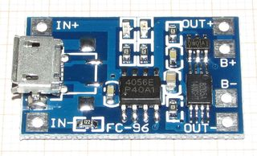

# UPSRaspberry

###Description
This is project of UPS for Raspberry Pi 2 based on TP4056 charging module and ATtiny13.

Idea from __hardlock.org.ua__ [1S li-ion indicator](http://hardlock.org.ua/viewtopic.php?f=9&t=442).

### Modes

 Nmbr |   Mode  | AC  | BATT | TIMER | OUT | LED
:----:| ------- |:---:|:----:|:-----:|:---:|:------
  0   | AC_OK   |  1  |  x   |   x   |  1  |  
  1   | BAT_OK  |  0  | >3v3 |   x   |  1  |  
  2   | BAT_LOW |  0  | <3v3 | TMR-- |  1  |  
  3   | BAT_CRT |  0  | <3v1 |   x   |  0  |  
  4   | STOPPED |  0  |  x   |   x   |  0  |  

### Hardware
Atmel controller

TP4056 1A Standalone Linear Li-lon Battery Charger

##### Fuses (default):
- Internal 1 MHz
- low_fuses = 0x62
- high_fuses = 0xDF
- extended_fuses = 0xFF

### Links
- http://hardlock.org.ua/viewtopic.php?f=9&t=442
- https://pi.gate.ac.uk/pages/mopi.html
- http://www.mosaic-industries.com/embedded-systems/microcontroller-projects/raspberry-pi/on-off-power-controller
- http://www.atmel.com/images/atmel-2586-avr-8-bit-microcontroller-attiny25-attiny45-attiny85_datasheet.pdf
- https://dlnmh9ip6v2uc.cloudfront.net/datasheets/Prototyping/TP4056.pdf

### Help
- https://guides.github.com/features/mastering-markdown/
- https://github.com/adam-p/markdown-here/wiki/Markdown-Cheatsheet
